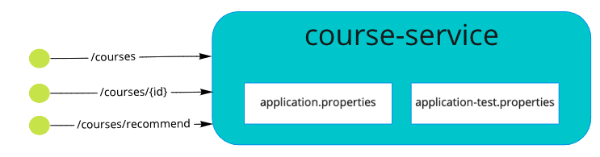
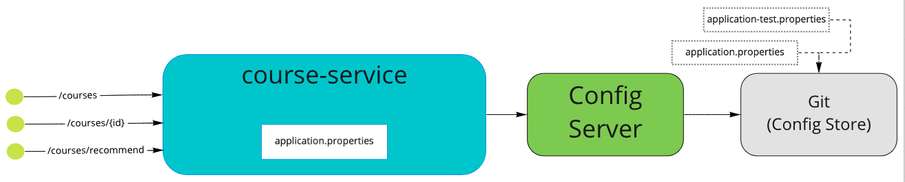
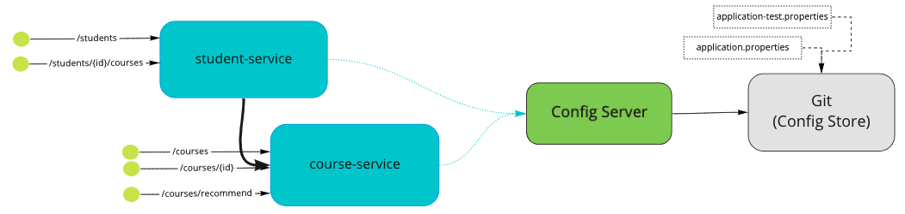
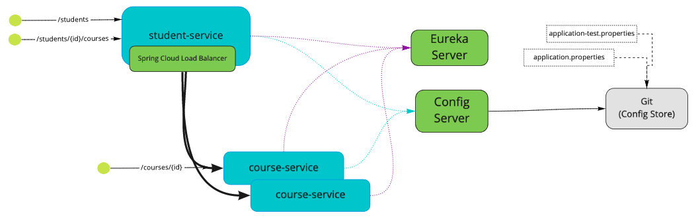
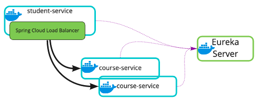
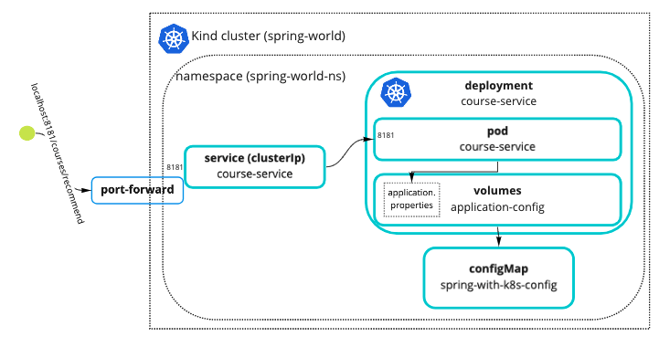
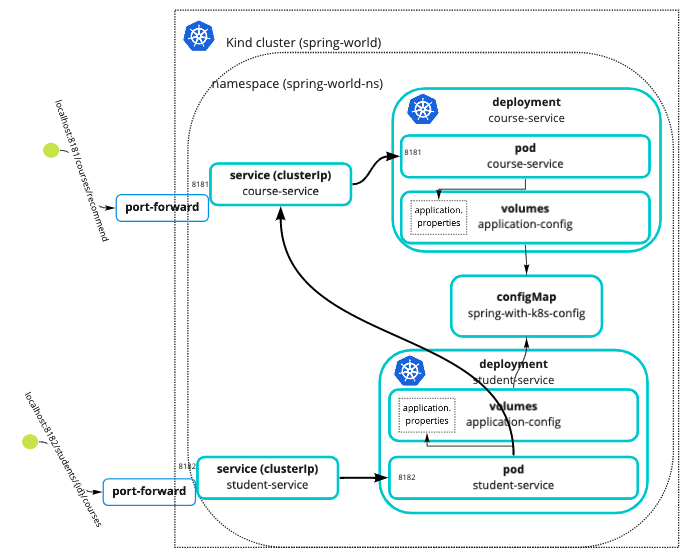

# Spring 310: Spring for Microservice and Kubernetes

Follow the branches
-----

0.0 : [Getting started with Project Setup](//tree/0.0-get-started)

0.1 : Using local configuration

0.2 : Externalizing configurations

0.3 : App to App communication using REST Template

0.3 : App to App communication using OpenFeign

 

0.4 : Service discovery using Eureka Server

 

---

## Docker and Kubernetes

1.0 : Build docker image and run Spring apps locally as docker container

1.1 : Deploying SpringBoot apps to Kubernetes

1.2 : Service discovery of SpringBoot apps in Kubernetes

