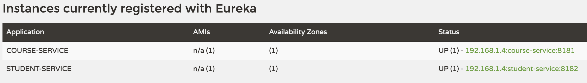
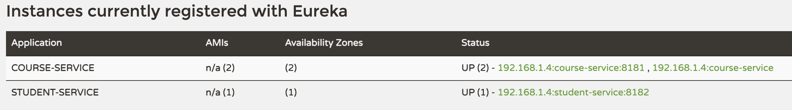

# service-registry

Run a local instance of Eureka server i.e a Service Registry

### Pre-requisites

* Java 11
* Maven

### Key code snippets and configurations

1. Refer `pom.xml`

```xml
<dependency>
    <groupId>org.springframework.cloud</groupId>
    <artifactId>spring-cloud-starter-netflix-eureka-server</artifactId>
</dependency>
```

2. Add `@EnableEurekaServer` to `public class ServiceRegistryApplication`

3.  Refer `application.properties`

```
spring.application.name=service-registry
server.port=8761

eureka.client.register-with-eureka=false
eureka.client.fetch-registry=false
```

4. After starting the eureka server, update `pom.xml` for all Spring-boot microservices

```xml
<dependency>
    <groupId>org.springframework.cloud</groupId>
    <artifactId>spring-cloud-starter-netflix-eureka-client</artifactId>
</dependency>
```

### Run

`mvn spring-boot:run -DSkiptest`

### Test

Launch from browser the Eureka dashboard http://localhost:8761/

* Apps registered with Eureka server
 


* Multiple instances of same app registered with Eureka server



